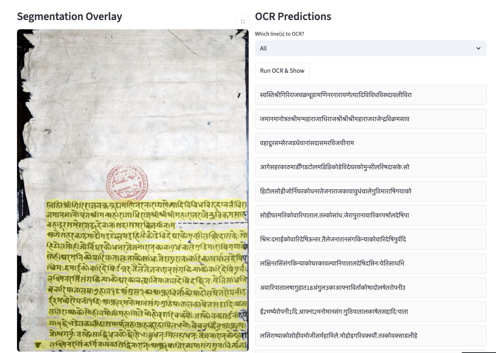

# Digitizing Nepal’s Written Heritage: A Comprehensive HTR Pipeline for Old Nepali Manuscripts

<p align="center">
  
</p>

<p align="center">
  Example of the end-to-end HTR pipeline output.<br/>
  <em>Left:</em> Sample of an Old Nepali manuscript line.
  <em>Right:</em> Predicted line-level transcription
</p>


This repository contains the **official implementation** of the paper **[Digitizing Nepal’s Written Heritage: A Comprehensive HTR Pipeline for Old Nepali Manuscripts](PAPER_LINK_HERE)**, by **Anjali Sarawgi, Esteban Garcés Arias, and Christof Zotter**.


## Abstract
This paper presents the first end-to-end pipeline for Handwritten Text Recognition (HTR) for Old Nepali, a historically significant but low-resource language. We adopt a line-level transcription approach and systematically explore encoder-decoder architectures and data-centric techniques to improve recognition accuracy. Our best model achieves a Character Error Rate (CER) of 4.9\%.  In addition, we implement and evaluate decoding strategies and analyze token-level confusions to better understand model behaviour and error patterns. While the dataset we used for evaluation is confidential, we release our training code, model configurations, and evaluation scripts to support further research in HTR for low-resource historical scripts.

## Environment
We use a conda Python 3.12 environment. To create and activate the env run:
```
conda create -n nepocr_env python=3.12
conda activate nepocr_env
pip install -r requirements.txt
```

## Dataset
we use 
